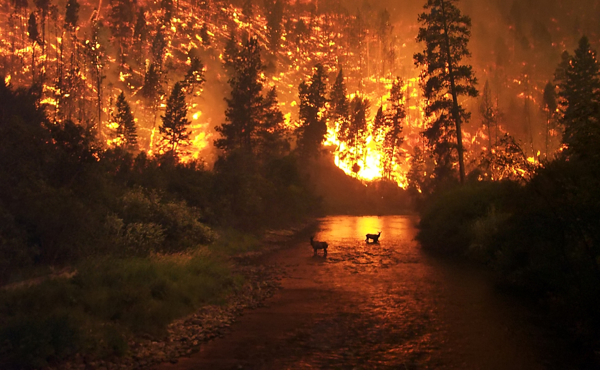

# Forest Fire Prediction

This repository contains a Jupyter Notebook that aims to predict the burned area of forest fires, in the northeast region of Portugal, by using meteorological and other data , The notebook is based on the [forestfires dataset](https://www.kaggle.com/datasets/elikplim/forest-fires-data-set/data) available on Kaggle.

## Table of Contents

* Dataset Overview
* Notebook Contents
* Dependencies
* Usage

## Dataset Overview

- The data is a CSV file

- The data is acquired from the following link:
    
    - https://archive.ics.uci.edu/ml/datasets/forest+fires

## Notebook Contents
The Jupyter Notebook included in this repository covers the following steps:

1- **Data Preprocessing**: The dataset is preprocessed to handle missing values, encode categorical variables, and remove duplicate values

2- **Exploratory Data Analysis (EDA)**: Various visualizations and statistical analyses are performed to gain insights into the distribution and relationships among different features in the dataset.

3- **Machine Learning (ML)**: Several machine learning algorithms such as linear regression, and random forest regressor are implemented to predict insurance costs. The models are trained, evaluated, and compared using appropriate metrics.

4- **Deep Neural Network (DNN)**: A deep neural network model is constructed using TensorFlow/Keras to predict insurance costs. The model architecture, training process, and evaluation results are presented.

## Dependencies
The following Python libraries are required to run the notebook:

* pandas
* numpy
* matplotlib
* seaborn
* scikit-learn
* TensorFlow/Keras
